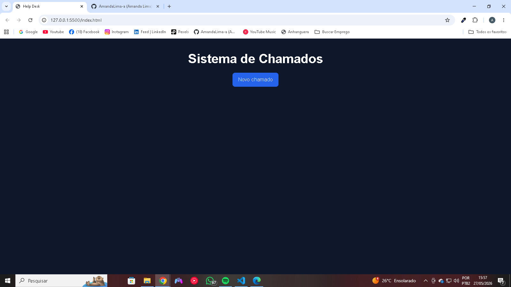
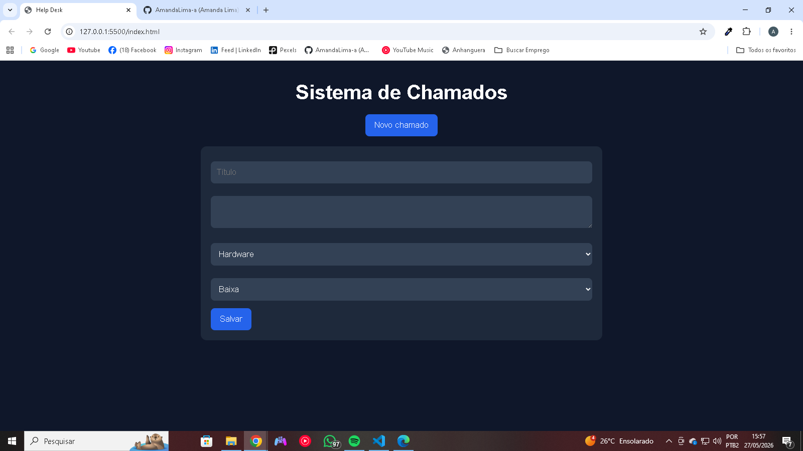
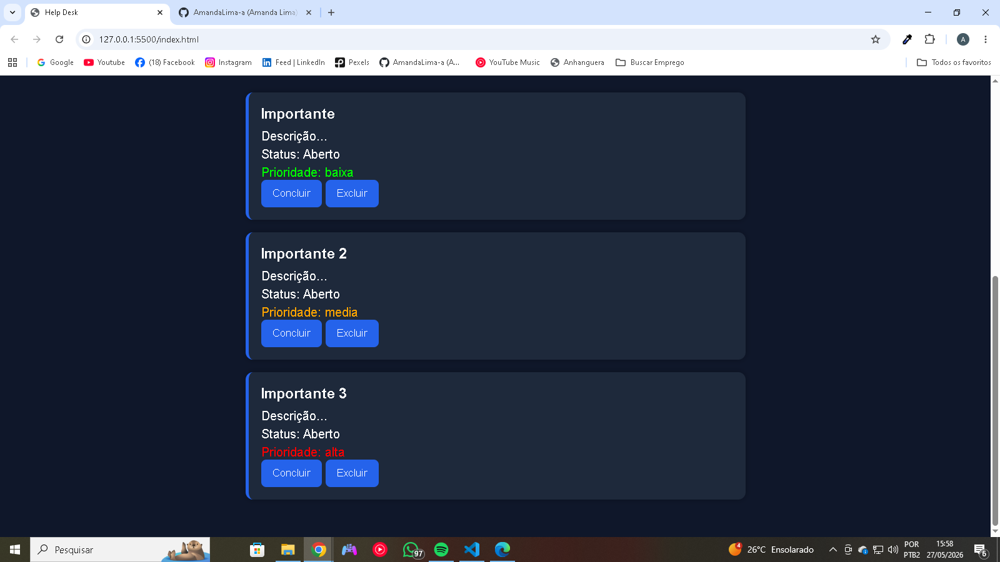

# 🎫 Help Desk

Sistema simples de gerenciamento de chamados desenvolvido com HTML, CSS e JavaScript puro.

## 📖 Sobre o projeto

O Help Desk permite registrar, visualizar e gerenciar chamados de suporte de forma prática. Os dados são armazenados no navegador utilizando LocalStorage, permitindo que os chamados permaneçam salvos mesmo após atualizar a página.

Este projeto foi desenvolvido com o objetivo de praticar conceitos fundamentais de desenvolvimento front-end e manipulação do DOM.

## 🚀 Funcionalidades

- ✅ Criar chamados
- ✅ Definir categoria
- ✅ Definir prioridade
- ✅ Visualizar chamados cadastrados
- ✅ Concluir chamados
- ✅ Excluir chamados
- ✅ Armazenamento em LocalStorage
- ✅ Interface responsiva

## 🛠️ Tecnologias utilizadas

- HTML5
- CSS3
- JavaScript (ES6)
- LocalStorage

## 📷 Demonstração

Acesse o projeto online:

**https://help-desk2026.netlify.app/**

## 🎯 Aprendizados

Durante o desenvolvimento deste projeto foram praticados conceitos como:

- Manipulação do DOM
- Eventos JavaScript
- Arrays e Objetos
- Funções
- Template Literals
- LocalStorage
- Estruturação de projetos Front-End
- Responsividade com CSS

## 📂 Estrutura do projeto

```text
help-desk/
│
├── index.html
├── style.css
├── script.js
└── README.md
```

## 🔮 Melhorias futuras

- Filtro por prioridade
- Pesquisa de chamados
- Edição de chamados
- Dashboard com estatísticas
- Sistema de autenticação
- Integração com banco de dados

## 📷 Screenshots

### Tela principal


### Cadastro de chamado


### Lista de chamados


## 🎥 Demonstração em vídeo

Vídeo demonstrando as principais funcionalidades do sistema:

https://drive.google.com/file/d/1eQ7Lban4xP29UGeLdvLdrkeh2ZZHDiEC/view?usp=sharing

## 👩‍💻 Autora

Desenvolvido por Amanda Lima como projeto de portfólio.
